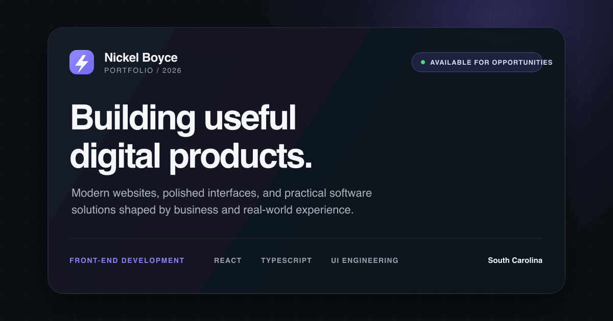

# Nickel Boyce — Developer Portfolio



A responsive personal portfolio for Nickel Boyce, a front-end developer and entrepreneur building modern websites, interfaces, and practical digital products.

[View the live portfolio](https://personal-landing-page-swart-iota.vercel.app/)

## Highlights

- Premium midnight interface with a restrained violet accent system
- Responsive layouts for desktop, tablet, and mobile
- Accessible keyboard focus, skip navigation, semantic landmarks, and reduced-motion support
- Project presentation with public-demo and protected-client states
- Responsive AVIF project imagery with WebP fallbacks
- Transparent email-draft contact workflow with direct email and phone alternatives
- Open Graph, X/Twitter card, canonical, favicon, and theme metadata

## Built with

- React 19
- TypeScript
- CSS
- Vite

## Local development

```bash
npm install
npm run dev
```

## Quality checks

```bash
npm run lint
npm run build
```

## Project structure

```text
src/
├── assets/       Project imagery
├── components/   Page sections and reusable project presentation
├── data/         Project, experience, capability, and toolkit content
├── App.tsx       Page composition and skip navigation
└── index.css     Design system and responsive styles
```

Some client previews are intentionally not linked publicly. Their portfolio cards clearly identify the protected state without exposing private deployments or source code.
